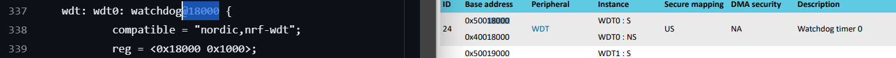
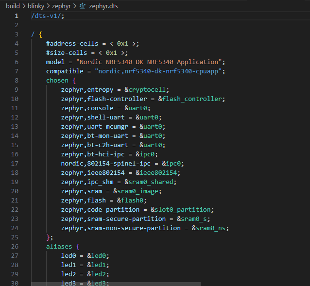
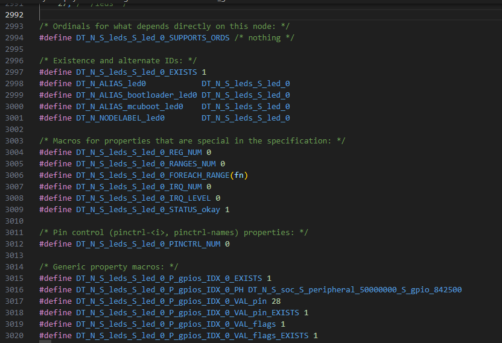

# Devicetree

A devicetree is way of structuring data which represents information about the devices on a board or target. It is defined by the [Devicetree specification](https://www.devicetree.org/).

There is a great resource for DeviceTree in the [Zephyr documentation](https://docs.zephyrproject.org/latest/build/dts/intro-scope-purpose.html).

>[!NOTE|style:flat|label:We're about to get heavy...]
>It's not essential to understand all of the inner workings of devicetree in order to build your own applications. In fact, many development kits already have a lot defined for you!
>
> For example, to build blinky, you could simply use the following command to use the default devicetree defined for the nrf5340dk:
>```bash
>west build -b nrf5340dk/nrf5340/cpuapp /workdir/zephyr/samples/basic/blinky --pristine
>```
>
>We'll take a look at the underpinnings of the build system, then step back and show you it's not as scary as it seems!

## What are Devicetree files?

Devicetree files *aren't* monolithic, so they can be split into seperate files and then be included in applicable constructs.

There are two types of devicetree input files: devicetree sources and devicetree bindings. The sources contain the devicetree itself. The bindings describe its contents, including data types. The build system uses devicetree sources and bindings to produce a generated C header. The generated header’s contents are abstracted by the `devicetree.h` API, which you can use to get information from your devicetree.

Here is a simplified view of the process:


[Above description from here](https://docs.zephyrproject.org/latest/build/dts/intro-scope-purpose.html).

---

### Different file types

Devicetree files can be identified by their file extensions ->

1. `*.dts` - DeviceTree Source - Usually your highest level structure, e.g. your board description,
   1. You'll find built-in board files in the `zephyr/boards/` directory
1. `*.dtsi` - DeviceTree Source Includes - an includes file, e.g. SoC information or pin mapping,
   1. You'll find SoC files in the `zephyr/dts/` directory
1. `*.overlay` - A third DeviceTree Source which provides project specific tailoring to overlay on top of your final devicetree. Overlay files effectively override other settings as they're applied last.
1. `*.yaml` - DeviceTree Bindings - Semantic information about node validity.
   1. You'll find bindings in `zephyr/dts/bindings/`
      1. **N.B.** To find the binding quickly, try searching for the file,  
      e.g. if it is `compatible = "zephyr,cdc-acm-uart"`, search for ["zephyr,cdc-acm-uart.yaml"](https://github.com/zephyrproject-rtos/zephyr/blob/main/dts/bindings/serial/zephyr%2Ccdc-acm-uart.yaml).

> [!TIP]
>Also of note for acronyms is `DTC` which is the `DeviceTree Compiler`.
>
>Zephyr runs on resource constrained devices and it's not really feasible to load a blob during runtime; It would add overhead in computation and storage, so for Zephyr the devicetree gets *fixed* during compilation.
>
>In the Linux kernel, the `DTC` is used to compile the device tree to a `*.dtb`.  
>`*.dtb` - DeviceTree Blob - a compiled binary of the devicetree.
>
>The Linux kernel parses the DTB *during runtime* and it can be changed without modyfying the application.

---

## Example

>[!ATTENTION|style:flat|label:Call to action]
>Look at some actual files, it's simpler to understand within context.

The following are examples of content for each of the file types.

> [!NOTE]
>The following snippets are included to be spoken about in person during a session.

### DTS

[nrf5340DK CPUAPP DTS file](https://raw.githubusercontent.com/zephyrproject-rtos/zephyr/main/boards/nordic/nrf5340dk/nrf5340dk_nrf5340_cpuapp.dts ':include :type=code')

---

### DTSI

[nrf5340DK CPUAPP Common DTSI file](https://raw.githubusercontent.com/zephyrproject-rtos/zephyr/main/boards/nordic/nrf5340dk/nrf5340_cpuapp_common.dtsi ':include :type=code')

>[!ATTENTION|style:flat|label:Call to action]
>Trace through from a board DTS, through to the SoC, via the includes files.
>
>Looking at the underlying peripherals and comparing to the datasheet, we can see how the abstraction system ultimately maps peripherals to our registers.
>
>

---

### Overlay

An `.overlay` file can be used to override paramaters, for example enabling a peripheral or changing the speed.

```overlay
/ {
        soc {
                serial0: serial@40002000 {
                        status = "okay";
                        current-speed = <115200>;
                        /* ... */
                };
        };
};
```

[Above example from here](https://docs.zephyrproject.org/latest/build/dts/howtos.html#use-devicetree-overlays).

Another overlay example, this time from the sample `subsys/usb/console`.  
In this case, we're redirection to Zephyr Console output to the CDC_ACM_UART0 node, effectively, sending our UART data over USB by using the CDC ACM class, cool!

[App overlay](https://raw.githubusercontent.com/zephyrproject-rtos/zephyr/main/samples/subsys/usb/console/app.overlay ':include :type=code')

> [!NOTE]
>You can also host multiple UARTs on a single USB - This is the premise for how `SNAP IT!` worked; one USB connection, 6 `COM` interfaces on your PC.  
>It's also what `Worblehat` was using and what we were looking at for debug access over USB.

---

### Binding

In the following example, the build system matches the `bar-device` node to its YAML binding because the node’s compatible property matches the binding’s `compatible:` line.

The following is an example device node ->

```DTS Node
/* Node in a DTS file */
bar-device {
     compatible = "foo-company,bar-device";
     num-foos = <3>;
};
```

A matching binding might be something like the following ->

```Matching Binding
# A YAML binding matching the node

compatible: "foo-company,bar-device"

properties:
  num-foos:
    type: int
    required: true
```

> [!NOTE]
>The binding has mandated that `num-foos` is defined, as an `int`.  
>If it isn't defined, an error will be thrown at configuration time.

[Above example from here](https://docs.zephyrproject.org/latest/build/dts/bindings-intro.html#a-simple-example).

---

>[!ATTENTION|style:flat|label:Call to action]
>Looking at the nodes and aliases in the devicetree for the nrf5340, can you work out how the blinky sample works?

---

### During configuration and build

You can see some of the output for devicetree generation during build ->

```terminal
root@docker:/workspaces/project(develop)
$ west build -b nrf5340dk_nrf5340_cpuapp /workdir/zephyr/samples/basic/blinky --pristine

...

|info|-- Found Dtc: /root/ncs/toolchains/e9dba88316/usr/local/bin/dtc (found suitable version "1.5.0", minimum required is "1.4.6") 
|info|-- Found BOARD.dts: /workdir/zephyr/boards/nordic/nrf5340dk/nrf5340dk_nrf5340_cpuapp.dts
|success|-- Generated zephyr.dts: /workspaces/project/build/blinky/zephyr/zephyr.dts
|success|-- Generated devicetree_generated.h: /workspaces/project/build/blinky/zephyr/include/generated/devicetree_generated.h
|success|-- Including generated dts.cmake file: /workspaces/project/build/blinky/zephyr/dts.cmake

```

#### Generated zephyr.dts

Taking a look at the first of the highlighted files, `zephyr.dts`, we can see the *whole* devicetree has been assembled for the board.



> [!TIP]
> This can be a very useful tool for debugging build issues, as it's effectively the source of truth.  
> E.g. you may be disabling a device in an includes file that you didn't realise, leading to it being incorrectly described in the resulting generated `*.dts` file.

#### Generated devicetree_generated.h

Looking at the `devicetree_generated.h` we can begin to see the underpinnings of our application.



---

## Checkpoint

>[!ATTENTION|style:flat|label:Call to action]
>Go back to [the build and configuration system](zephyr/what?id=the-build-and-configuration-system)  
>Can you tell which aspects are part of devicetree?
