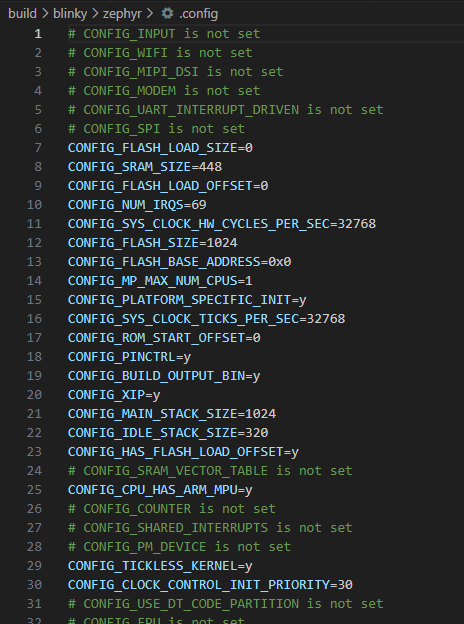
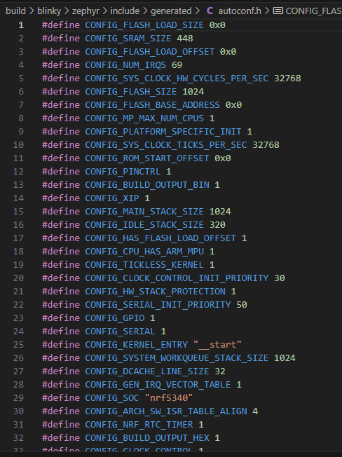

# Kconfig

The Zephyr kernel and subsystems can be configured at build time to adapt them for specific application and platform needs. Configuration is handled through Kconfig, which is the same configuration system used by the Linux kernel. **The goal is to support configuration without having to change any source code.**

Configuration options (often called symbols) are defined in Kconfig files, which also specify dependencies between symbols that determine what configurations are valid. Symbols can be grouped into menus and sub-menus to keep the interactive configuration interfaces organized.

The output from Kconfig is a header file autoconf.h with macros that can be tested at build time. Code for unused features can be compiled out to save space.

[The above is from here](https://docs.zephyrproject.org/latest/build/kconfig/index.html).

---

## What are Kconfig files?

For the most part, the primary file you'll interact with is `prj.conf`.  
This is where you will set you project specific tailorings.

The initial configuration for an application comes from merging configuration settings from three sources:

1. A BOARD-specific configuration file stored in `boards/<VENDOR>/<BOARD>/<BOARD>_defconfig`,
1. Any CMake cache entries prefix with `CONFIG_`,
1. The application configuration in `prj.conf`.

[The above is from here](https://docs.zephyrproject.org/latest/build/kconfig/setting.html).

> [!ATTENTION]
>`prj.conf` is a mandatory file in your project; if it does not exist then a fatal error will occur.

### Example

Here is an example `prj.conf` from `zephyr/samples/basic/blinky`

[Blinky prj.conf](https://raw.githubusercontent.com/zephyrproject-rtos/zephyr/main/samples/basic/blinky/prj.conf ':include :type=code')

---

### During configuration and build

You can see some of the output for Kconfig during build ->

```terminal
root@docker:/workspaces/project(develop)
$ west build -b nrf5340dk_nrf5340_cpuapp /workdir/zephyr/samples/basic/blinky --pristine

...

|warning|-- Board: nrf5340dk, qualifiers: nrf5340/cpuapp
|warning|Parsing /workdir/zephyr/share/sysbuild/Kconfig
|warning|Loaded configuration '/workspaces/project/build/_sysbuild/empty.conf'
|warning|Merged configuration '/workspaces/project/build/_sysbuild/empty.conf'
|warning|Configuration saved to '/workspaces/project/build/zephyr/.config'
|warning|Kconfig header saved to '/workspaces/project/build/_sysbuild/autoconf.h'
|warning|--

...

|success|Parsing /workdir/zephyr/Kconfig
|success|Loaded configuration '/workdir/zephyr/boards/nordic/nrf5340dk/nrf5340dk_nrf5340_cpuapp_defconfig'
|success|Merged configuration '/workdir/zephyr/samples/basic/blinky/prj.conf'
|success|Merged configuration '/workspaces/project/build/blinky/zephyr/.config.sysbuild'
|success|Configuration saved to '/workspaces/project/build/blinky/zephyr/.config'
|success|Kconfig header saved to '/workspaces/project/build/blinky/zephyr/include/generated/autoconf.h'

```

> [!NOTE]
>The initial references to Kconfig, highlighted in orange, are for Sysbuild, that's beyond the scope of what we'll look at today, but you can find [some information here](https://docs.zephyrproject.org/latest/build/sysbuild/index.html).

---

#### Generated .config

Taking a look at the `.config`, we can see the *whole* config has been assembled for the board.



> [!TIP]
> This can be a very useful tool for debugging build issues, as it's effectively the source of truth.  
> E.g. a config file *might not* be being picked up by the build system.

#### Generated autoconf.h

Taking a look at the `autoconf.h`, we can see include file for our application.



---

## Checkpoint

>[!ATTENTION|style:flat|label:Call to action]
>Go back to [the build and configuration system](zephyr/what?id=the-build-and-configuration-system)  
>Can you tell which aspects are part of Kconfig?
