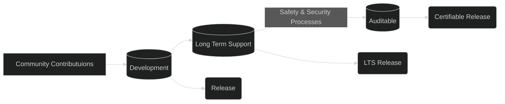

# What is Zephyr?

Zephyr is a small real-time operating system for connected, resource-constrained and embedded devices supporting multiple architectures and released under the Apache License 2.0.  
[Above reproduced from](https://en.wikipedia.org/wiki/Zephyr_(operating_system))

You can find the Zephyr repository [here on GitHub](https://github.com/zephyrproject-rtos/zephyr).

---

## Membership

Many organisations support the Zephyr Project as `members`. These vary from the likes of Si companies such as Nordic Semi, Infineon, Analog Devices, and NXP to training, services, and consultants such as Golioth, Laird, and Antmicro.

Membership effectively allows them participation on steering committees as follows ->

| Membership Level |	Platinum |	Silver	| Associate	|Community|
| --- | --- | --- | --- | --- |
|Zephyr Code Access & Development Participation	|Yes	|Yes	|Yes	|Yes|
|Zephyr Technical Steering Committee	|Yes	|Yes	|Per contribution level	|Per contribution level|
|Governing Board Participation	|Yes	|1 representative for every 10 Silver members|	No|	No|
|Governing Board Voting |	Yes|	1 vote for every 10 Silver members	|No	|No|
|Marketing Committee Participation	|Yes	|Yes	|Yes	|No|
|Safety Committee Participation|	Yes	|By Invitation	|By Invitation	|By Invitation|
|Security Committee Participation	|Yes	|By Invitation|	By Invitation|	By Invitation|
|Access to Certification Audit Artifacts	|Yes	|No	|No	|No|

[Table above is reproduced from here](https://www.zephyrproject.org/join/)

---

## Why Zephyr?

1. Large, and growing, community,
1. Bredth and depth of extant materials,
   1. Example code and projects,
   1. Sensor drivers,
   1. Tooling.
1. Convenient abstraction system,
   1. Decouple the application from the hardware

### Downsides

1. The abstraction system relies on a lot of macros and wizardry to give you flexibility; the intial learning ramp `can` be steep.
   1. You don't need to understand all of the inner workings in order to develop

---

## Releases

There are three primary release streams that are interrelated.

You'll `mostly likely` use the LTS release for product development as it's stable.

<!-- tabs:start -->

### **Development**

The bleeding edge. Features may be added or be changed, items may be deprecated

1. Has the cutting-edge functionality
1. Latest changes from the community

### **LTS (Long Term Support)**

!> Doesn’t include cutting-edge functionality

1. Current with latest Security Updates
1. Compatible with new hardware
   1. Functional support for new hardware is regularly backported
1. Tested: Shorten the development window and extend the Beta cycle to allow for more testing and bug fixing
1. Supported for 2+ years

### **Auditable**

?> An auditable code base will be established from a subset of the Zephyr OS LTS

1. Code bases will be kept in sync
1. More rigorous processes (necessary for certification) will be applied to the auditable code base.
1. Processes to achieve selected certification to be:
   1. Determined by Safety Committee and Security Committee
   1. Coordinated with Technical Steering Committee 

<!-- tabs:end -->

---

## How does it work?

### The build and configuration system

Zephyr borrows a couple of features from the Linux Kernel, notably Device Tree and KConfig. The Device Tree handles the hardware aspects, whilst KConfig handles a lot of the source code aspects.  
These systems are driven by CMake.

We'll get into what these systems are and what they do over the next few pages...
